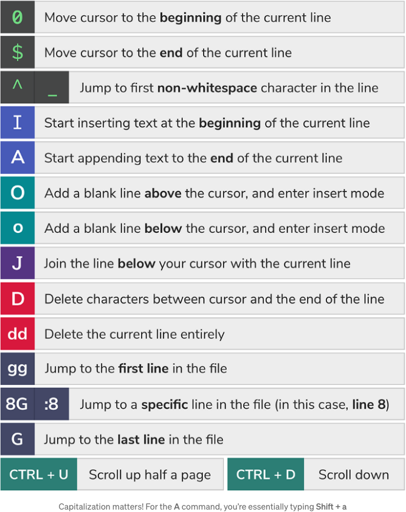

Vim Cheat Sheet

- :w 	Save
- :x 	Save & Exit
- :q 	Exit if no changes made
- :q! 	Exit & discard any changes

- Shift zz = :wq

- G 	End of file
- gg	Start of document
- dd 	Delete current line
- D 	Delete the rest of line
- U 	Undo all changes to line

## [Write Code Faster in Vim](https://jacobcomer.medium.com/write-code-faster-in-vim-c564ff9b9f6c)

With how much code you produce in a day, mastering your text editor is an investment that will pay dividends for the rest of your engineering career. 

